

  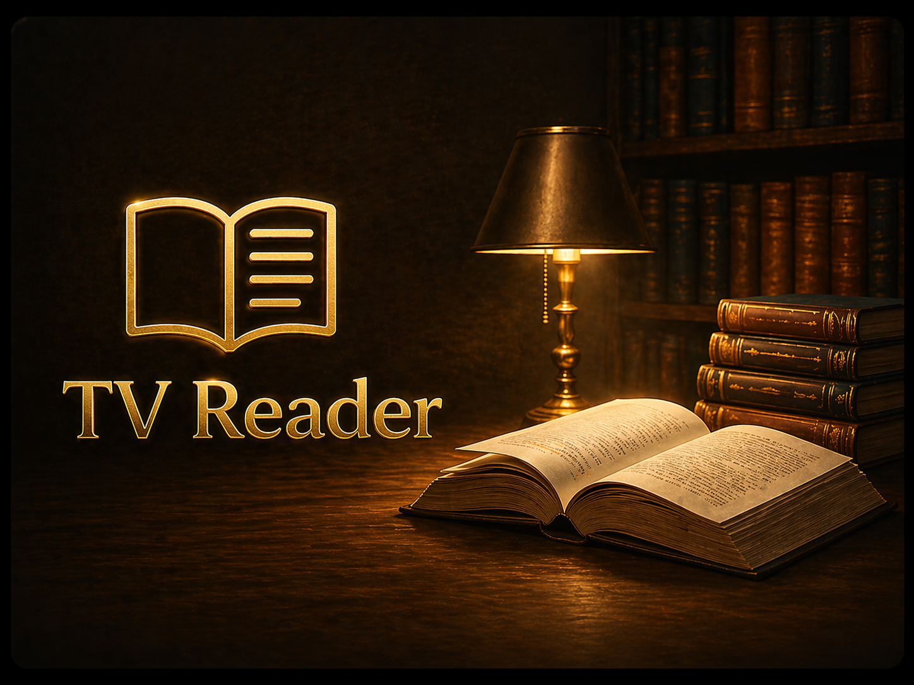

<h1 align="center">TV Reader</h1>

  <em>The only e-reader built for your couch and remote.</em>

  
  &nbsp;
  
  &nbsp;
  

---

Most ebook readers are made for phones and tablets. On Android TV they either lack D-pad support, have tiny buttons you can't reach with a remote, or simply don't exist.

TV Reader was designed from scratch for the remote control. Every screen, every menu, every interaction works with the D-pad. Sit on the couch, pick up the remote, and read.

---

## Screenshots

  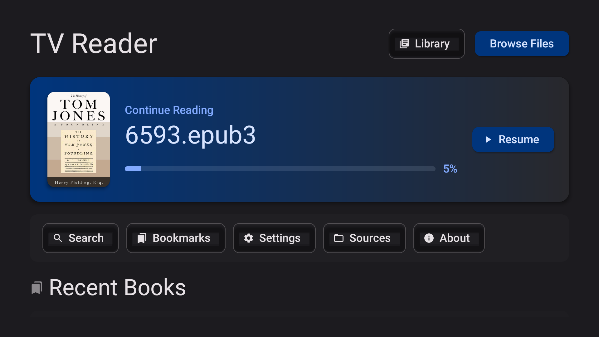
  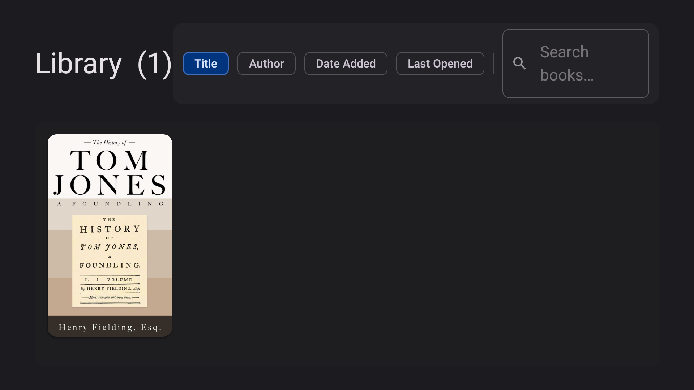

  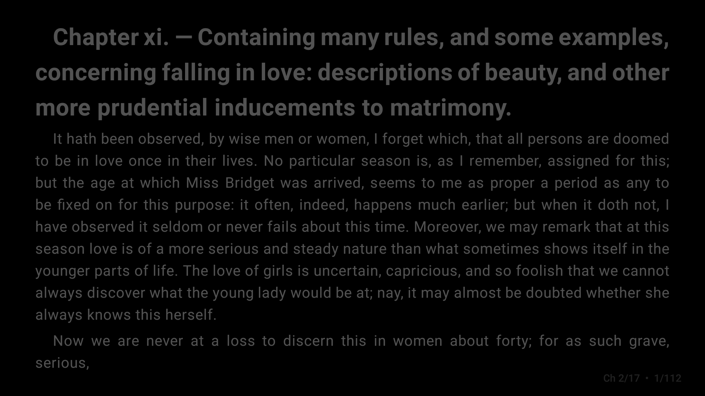
  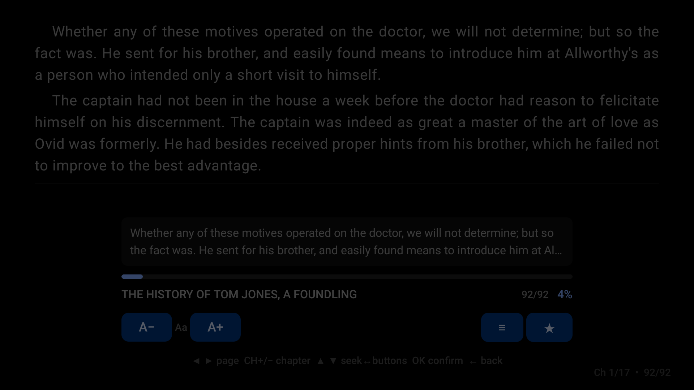

  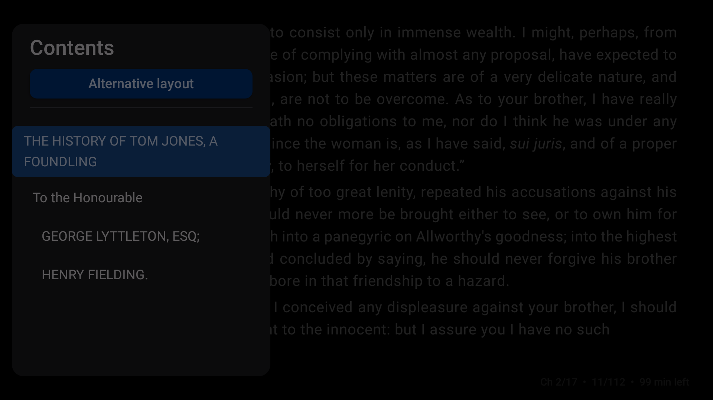
  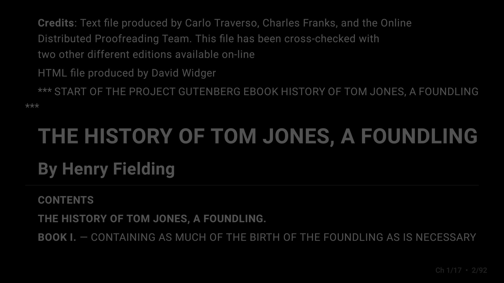

  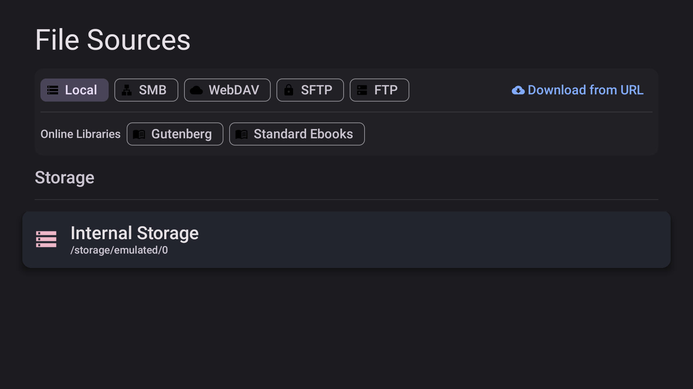
  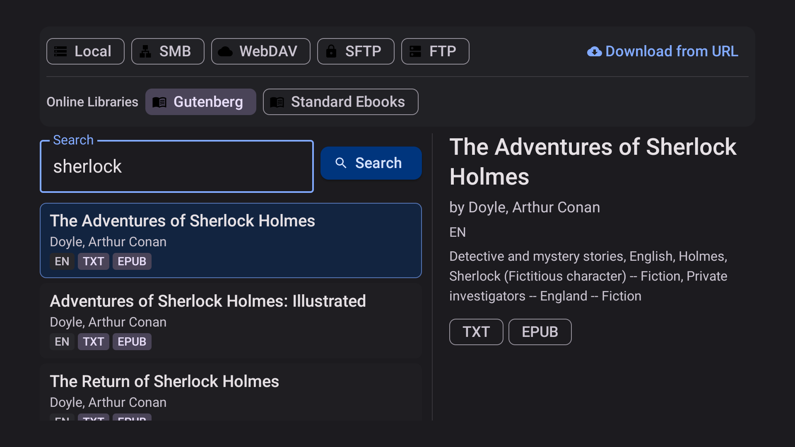

  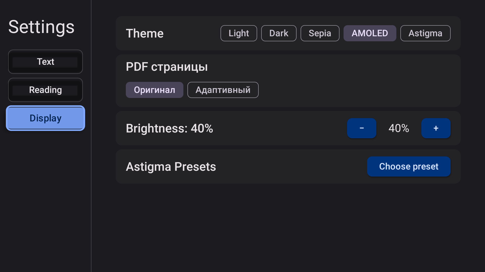
  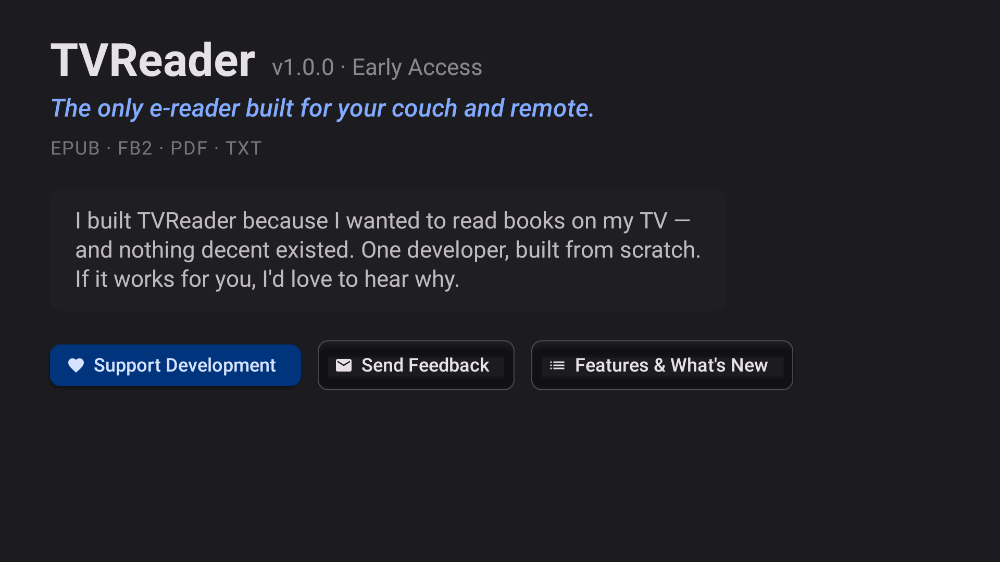

---

## Features

**Reading**
- Full D-pad navigation — every element reachable with the remote, no touch required
- Continuous scroll and page-by-page modes
- Alternative layout — document-style view with title, author, and full TOC as a page
- Table of contents — side panel, chapter navigation with the remote
- Bookmarks — mark pages across any book
- Focus Mode — hides UI chrome for distraction-free reading

**Display**
- 5 themes: Light, Dark, Sepia, AMOLED, Astigma
- Astigma presets — reduced contrast palette for eye strain
- Adjustable font size from the reader toolbar

**Library & Sources**
- Library — your collection with cover art, sort by title / author / date / last opened
- Continue Reading — resume last book from the home screen with progress bar
- Local storage — browse internal storage and USB drives directly
- Network sources — SMB (NAS), WebDAV, SFTP, FTP
- Download from URL — paste any direct link, it downloads and opens
- Project Gutenberg — search and download 70,000+ free books in-app
- Standard Ebooks — curated free library with professional-quality editions
- Open with — open supported files from any file manager or browser on the TV

---

## Supported Formats

| Format | Notes |
|--------|-------|
| EPUB | Full support including embedded images |
| FB2 | Common in Russian-language ecosystems |
| PDF | Scroll and page-by-page modes |
| TXT | Plain text, adjustable font size |
| MD | Markdown with basic rendering |
| HTML | Web-formatted documents |
| CBZ | Comic book archive — image sequences |

---

## Installation

TV Reader is distributed as an APK — no Google Play account required.

1. Download the latest APK from the [**Releases**](https://github.com/Sozdan2016/TVReader-releases/releases/latest) page
2. On your Android TV: **Settings → Device Preferences → Security → Unknown Sources → ON**
3. Transfer the APK to your TV (USB drive, file manager, or sideloading tool of your choice)
4. Install and open

> **Minimum Android version:** Android 5.1 — works on most Android TV boxes and smart TVs from 2016 onward.

---

## Getting Books onto Your TV

- **Local storage** — copy files to USB or internal storage, browse them inside the app
- **SMB / WebDAV / SFTP / FTP** — connect directly to a NAS or home server
- **Download from URL** — paste any direct link to an EPUB, FB2, or PDF
- **Project Gutenberg** — built-in search, download and open in one step
- **Standard Ebooks** — curated free library, browse and download directly
- **Open with** — from a browser or file manager on the TV, open with TV Reader

---

## Feedback

This is a solo project. Feedback at this stage directly shapes what gets built next.

**Telegram:** [@tvreader_bot](https://t.me/tvreader_bot) — bug reports, feature requests, general thoughts. I read everything.

Issues on GitHub also work fine.

---

## Roadmap

Nothing promised, but things actively in progress:

- Google Play release
- Better book covers and library polish
- Calibre server support
- Reading statistics

---

## Support

TV Reader is free with no feature limits. If you find it useful and want to support continued development, there's a subscription option inside the app.

---

## License

Source code is available in this repository.

---

*Built by one person who wanted to read books on the couch without holding a phone.*
